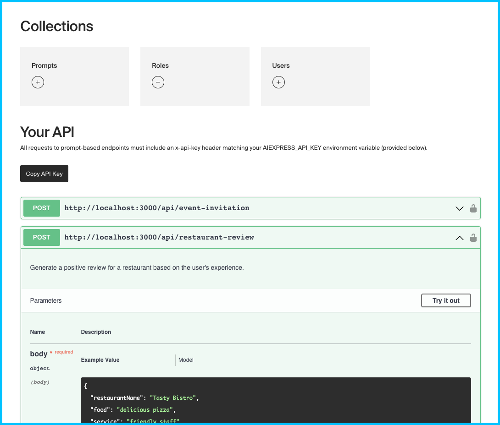
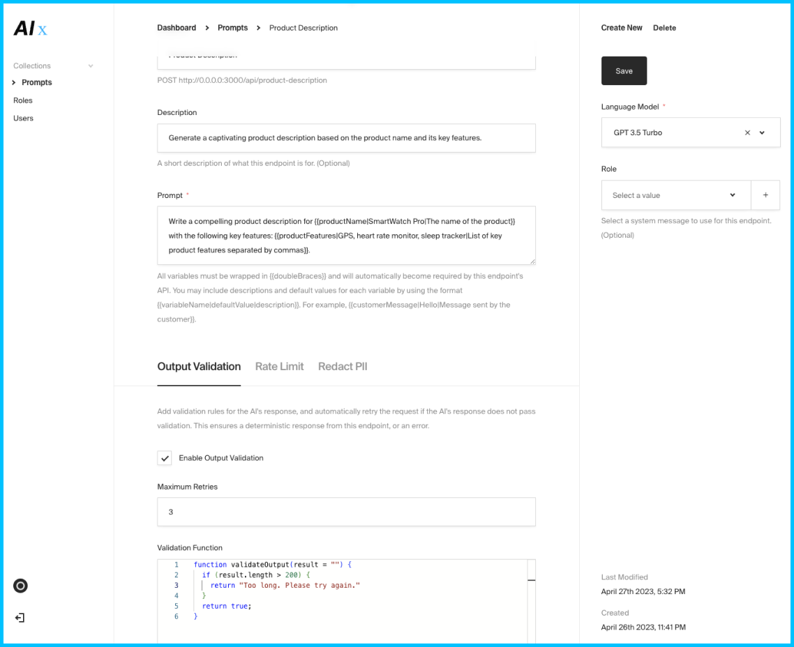

A fast way to turn AI prompts into ready-to-use API endpoints– deploy with a few clicks and manage prompts with automated variable inference & substitution in a neat visual interface.

Run locally, or deploy in one click using the button below. If you are deploying AI Express for production use, make sure to customize the AIEXPRESS_API_KEY environment variable with a new random value that you keep secret.

 If you're deploying elsewhere, you will likely need to set up a database on MongoDB Atlas.

1. [Sign up for MongoDB](https://www.mongodb.com/cloud/atlas/register). On the "Deploy your database" screen, select AWS, M0 – Free (or whatever level of hosting you'd like, but free really ought to be more than enough).

2. Create a user profile for the new database and make a note of your database username and password. Then from the "Network Access" page, click "Add IP Address" then "Allow access from anywhere". You can easily configure this later to include only the IP addresses of your Render deployment for extra security.

3. Go to "Database" in the sidebar, click the "Connect" button for the database you just created, select "Drivers", and copy the connection string URL. Note that you'll need to fill in the `<password>` part of the URL with that of the profile you created in step 2.

Then set your connection URL as the `MONGODB_URI` environment variable wherever you host AI Express.

## Usage

This template uses a simple express server with a Payload CMS configuration to give you a neat interface to manage prompts, updating your API dynamically whenever you publish/modify prompts on it.

Every prompt document created becomes a live API endpoint, and any variable in double curly braces in the prompt text, like `{{name}}`, `{{age}}`, `{{color}}`, etc. automatically becomes a requirement to the JSON body that API endpoint will expect and check for in an HTTP POST request.

Variable notation can be extended to include more info `{{variableName|defaultValue|description}}`, prompts are automatically validated for token length against the model selected in the text editor, and API documentation + a test bench are maintained via Swagger so you can test changes to your prompts without firing up Postman.

The API will wait for and output the top chat completion `completion.data.choices[0].message.trim()` in a simple JSON object of the format `{ result: <your_completion> }`. If there was an error of any kind, you will receive `{ result: null, error: <error_message> }`.

## Development

1. Ensure MongoDB is installed locally – Instructions: [Mac](https://www.mongodb.com/docs/manual/tutorial/install-mongodb-on-os-x/), [Windows](https://www.mongodb.com/docs/manual/tutorial/install-mongodb-on-windows/). Don't forget to start it using `brew services start mongodb-community` or equivalent.

2. Rename the `.sample.env` file to `.env`, adding your Open AI API key, and updating `AIEXPRESS_API_KEY` with a new random value.

3. `yarn` and `yarn dev` will then start the application and reload on any changes. Requires Node 16+.

### Docker

If you have docker and docker-compose installed, you can run `docker compose up`. You may need to run `sudo chmod -R go+w /data/db` on the data/db directory first.

## Future

Low-hanging fruit:

- Optional in memory caching of LLM output based on exact prompt text
- Prebuilt and configurable processors that extract text when the endpoint is provided with URL's to files (text/excel/json/pdf/websites)
- Global values/snippets that can be pre-fetched and referenced across all prompts

Requires vector DB:

- Automatic “prompt splitting” into vector db and lookup if prompt is too long
- Optional index of and lookup through all prior output for a particular endpoint
- Separate tab where documents/urls/websites can be uploaded, extracted, and are automatically be drawn upon globally

Other:

- VM mode where only Python or JS code is output, automatically executed in a sandbox, results are provided through JSON, after a prompt chain against any error messages until `max_retries`

Contributions are welcome.
