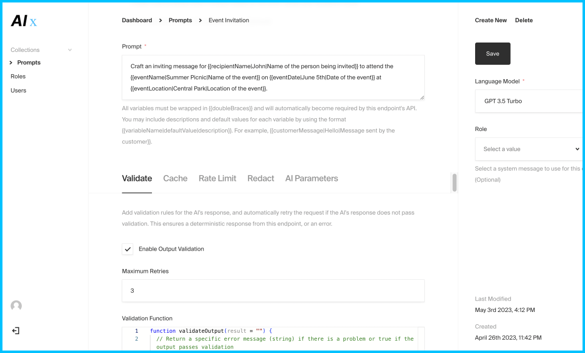

## 

The fastest way to turn AI prompts into ready-to-use API endpoints– deploy with a few clicks and manage prompts with automated variable inference & substitution in a neat visual interface.

Run locally, or deploy in 2 minutes using the button below. If you are deploying AI Express for production use, make sure to customize the AIEXPRESS_API_KEY environment variable with a new random value that you keep secret.

## Usage

This template uses a simple express server with a Payload CMS configuration to give you a neat interface to manage prompts, updating your API dynamically whenever you publish/modify prompts on it.

Every prompt document created instantly becomes a live API endpoint, and any variable in double curly braces in the prompt text, like `{{name}}`, `{{age}}`, `{{color}}`, etc. automatically becomes a requirement to the JSON body that API endpoint will expect and check for in an HTTP POST request.

Variable notation can be extended to include more info `{{variableName|defaultValue|description}}`, prompts are automatically validated for token length against the model selected in the text editor, and API documentation + a test bench are maintained via Swagger so you can test changes to your prompts without firing up Postman.

The API will wait for and output the top chat completion `completion.data.choices[0].message.trim()` in a simple JSON object of the format `{ result: <your_completion> }`. If there was an error of any kind, you will receive `{ result: null, error: <error_message> }`.

## Development

1. Ensure MongoDB is installed locally – Instructions: [Mac](https://www.mongodb.com/docs/manual/tutorial/install-mongodb-on-os-x/), [Windows](https://www.mongodb.com/docs/manual/tutorial/install-mongodb-on-windows/). Don't forget to start it using `brew services start mongodb-community` or equivalent.

2. Rename the `.sample.env` file to `.env`, adding your Open AI API key, and updating `AIEXPRESS_API_KEY` with a new random value.

3. `yarn` and `yarn dev` will then start the application and reload on any changes. Requires Node 16+.

### Docker

If you have docker and docker-compose installed, you can run `docker compose up`. You may need to run `sudo chmod -R go+w /data/db` on the data/db directory first.

## Future

- A demo deployment + account to click around in without needing to deploy.
- Use Payload's form building plugin to let folks put together end-user apps.
- A hosted service that makes setup even quicker, if there's interest.

Contributions are welcome.
